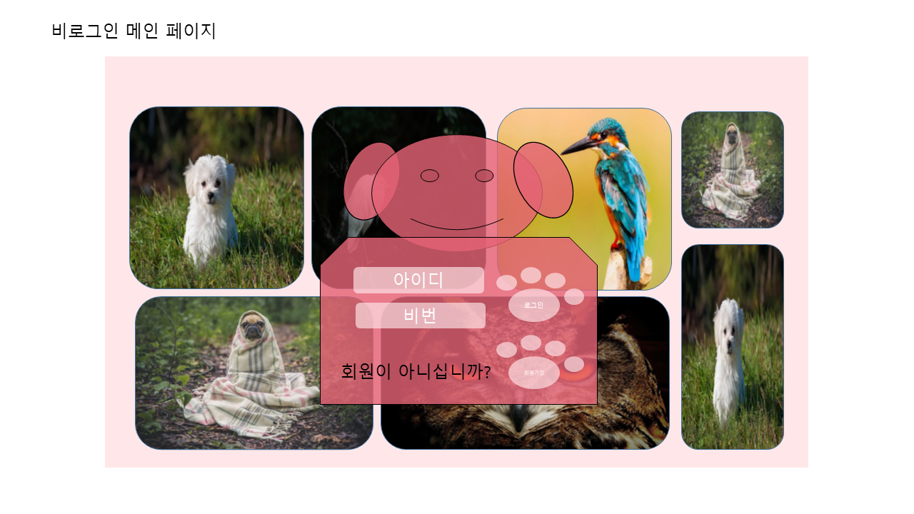
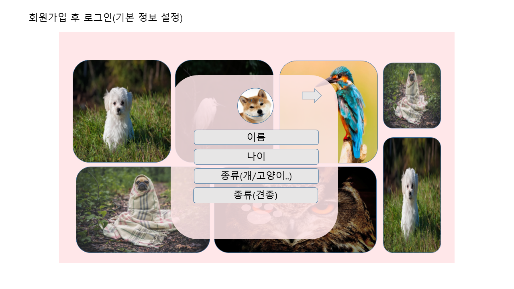
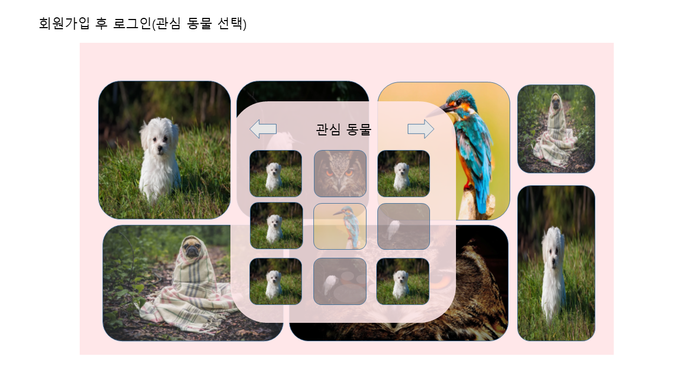
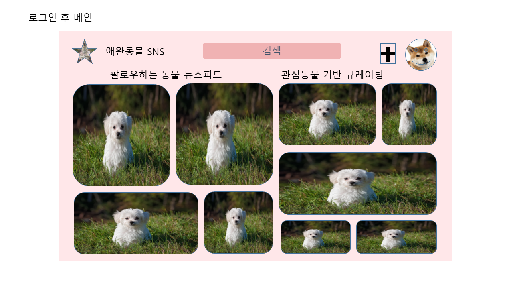
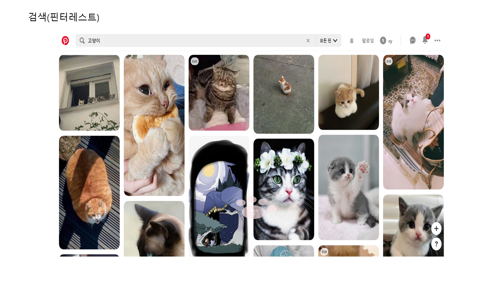
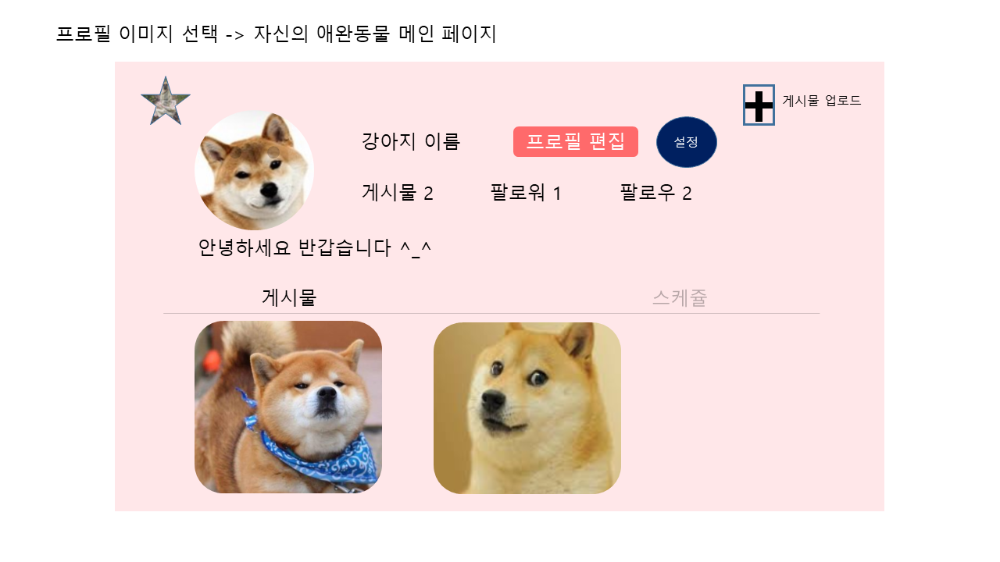
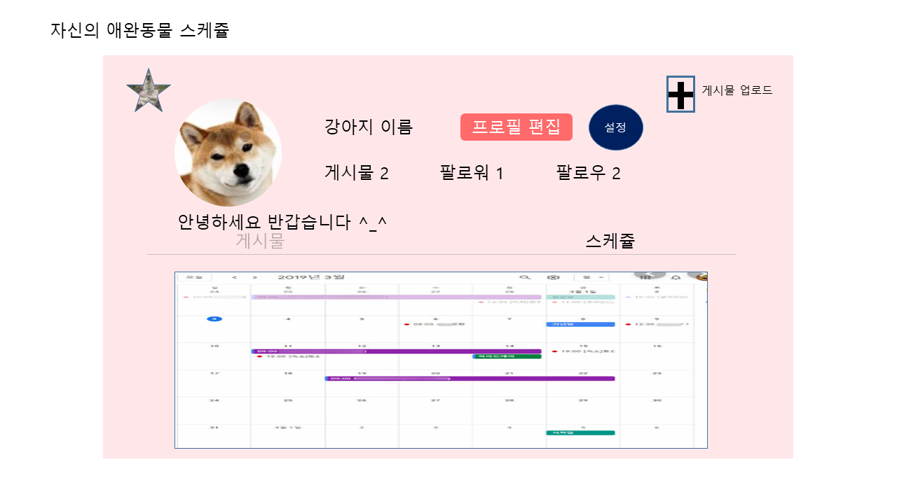
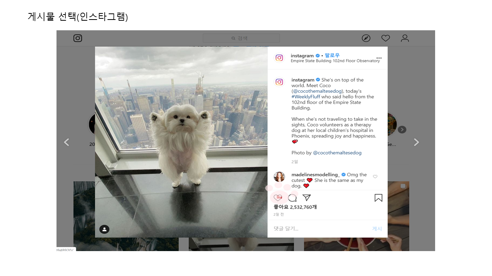
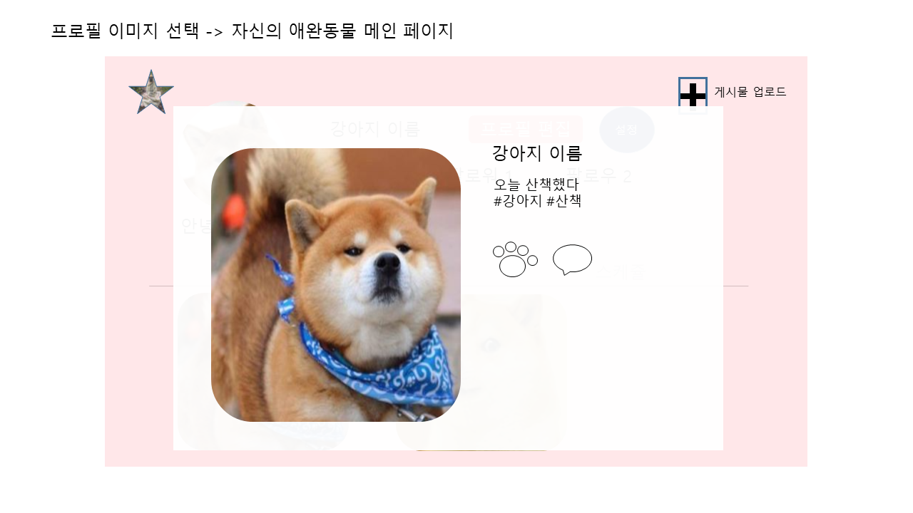

## 와이어프레임 (2020.01.20)

애완동물 자랑 SNS 컨셉으로 와이어프레임을 작성했습니다.

사이트에 들어가면 로그인/회원가입 화면이 나오고 배경에는 사이트에서 인기가 많은 사진들이 랜덤으로 보여집니다.

위는 회원가입 화면입니다.

회원가입 버튼을 누르면 기본 설정을 하는 화면이 나옵니다.

프로필 사진을 설정하고 이름, 나이 등 자신의 애완동물의 기본적인 사항을 입력합니다.

다음으로 SNS 메인에 보여질 관심 동물들을 체크합니다.

로그인을 하면 위와 같은 화면이 나오고

팔로우하는 동물, 관심동물 탭을 선택하면 각각에 맞게 동물 사진들이 큐레이팅되어 보여집니다.

위는 핀터레스트라는 사이트에서 '고양이'를 검색했을 때의 화면입니다.

위와 같이 검색을 하면 검색어에 해당하는 사진들이 최신순/인기순으로 보여집니다.

프로필 이미지를 선택하면 자신의 애완동물 페이지가 나옵니다.

인스타그램을 참고하였습니다.

스케쥴 탭을 누르면 달력이 나옵니다.

게시물을 업로드할 때 '다이어리 추가' 를 선택하면 캘린더에 동기화됩니다.

위는 인스타그램에서 게시물 사진을 클릭했을 때의 화면입니다.

큐레이팅 된 사진 혹은 본인의 게시물을 클릭하면 위와 같이 사진, 글, 좋아요, 댓글이 보여집니다.